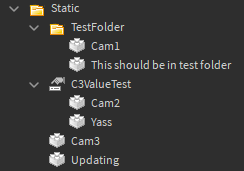
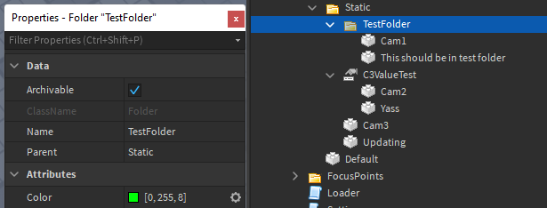
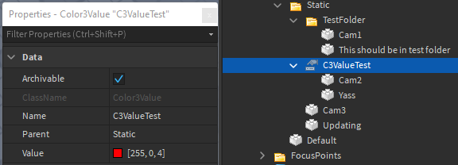

# Camera categories

Cameras can be categorised into folders to make it easier to find the one you're looking for.

A camera category can be a Folder or a Color3Value

-   If it's a Folder, then setting a `Color` attribute on it (type - `Color3`) will change the header color inside of the control panel
-   If it's a Color3Value, then setting it's value will change the header
-   Categories can have an `Order` (type - `number`) attribute set to it to change the order they'll appear in

If a camera isn't in a category then it'll go into a category named `Uncategorised` at the bottom of the camera chooser

!!! example
    In the image below:

    * `Cam1` and `This should be in test folder` are in the `TestFolder` category, `Cam2` and `Yass` are in the `C3ValueTest` category, and `Cam3` and `Updating` are in the `Uncategorised` category
    * `TestFolder` category will have a green banner, while `C3ValueTest` category will have a red banner

    
    
    
